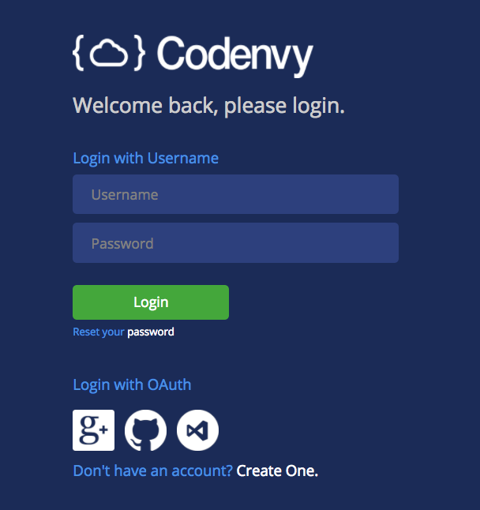
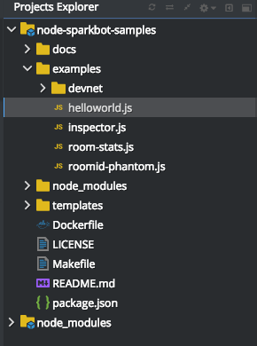
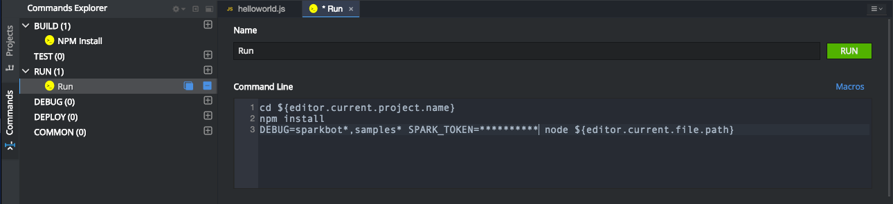
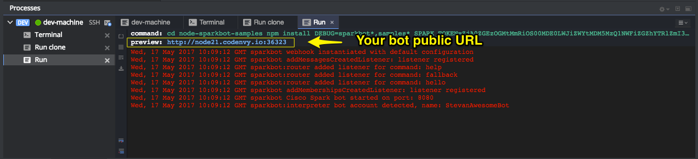

# "How to" Guide: run your Cisco Spark bot on Codenvy.io

[Codenvy](https://codenvy.io/) is a Cloud workspaces solution from which you can edit nodejs source code, but also run and debug your bots.

## Quick start:

### Use the following button to get a ready-to use Cisco Spark workspace.

You'll be asked to sign up at Codenvy.io before getting your workspace.

### Choose a test or example

Pick a javascript bot sample in the Codenvy Project explorer on the left, and click run.

### Customize your bot

In Codenvy Commands pane on the left, you can get all the commands defined in your workspace.
Open the "Run" command and set the following environment variables:
- SPARK_TOKEN: paste your Spark token, obtained from https://developer.ciscospark.com/

### Run or debug your bot

As you bot starts, it shows your bot public URL

ex: your code is running at http://node21.codenvy.io:36323

### Register your bot on Spark 

[Create a Webhook](https://developer.ciscospark.com/endpoint-webhooks-post.html)

note that you can either register a single webhook for all events, or several webhooks for each resource/event your bot listens to.

